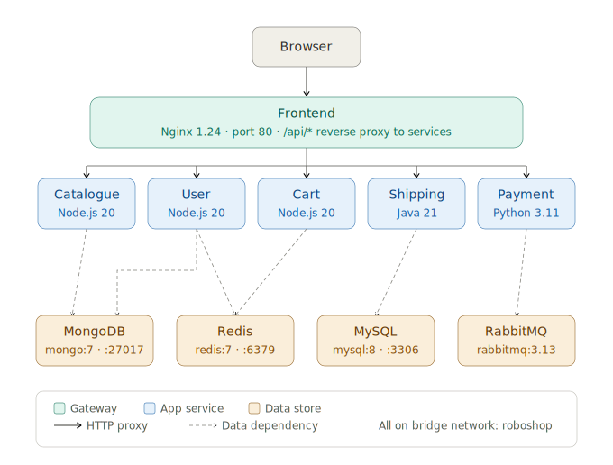

# RoboShop — Docker Setup

RoboShop is a microservices-based e-commerce demo application. This repo contains Dockerfiles and a `docker-compose.yml` to run the entire stack locally with a single command.

---

## Architecture



```
                        ┌─────────────────────────────────────────────────────┐
                        │                  User / Browser                     │
                        └──────────────────────┬──────────────────────────────┘
                                               │ HTTP :80
                        ┌──────────────────────▼──────────────────────────────┐
                        │              Frontend  (Nginx 1.24)                 │
                        │                                                     │
                        │  /api/catalogue/ ──►  catalogue:8080               │
                        │  /api/user/      ──►  user:8080                    │
                        │  /api/cart/      ──►  cart:8080                    │
                        │  /api/shipping/  ──►  shipping:8080                │
                        │  /api/payment/   ──►  payment:8080                 │
                        └──────┬──────┬──────┬──────┬──────┬─────────────────┘
                               │      │      │      │      │
              ┌────────────────▼──┐ ┌─▼──┐ ┌▼───┐ ┌▼──────────┐ ┌────────────────┐
              │   Catalogue       │ │User│ │Cart│ │  Shipping  │ │    Payment     │
              │   Node.js 20      │ │Node│ │Node│ │  Java 21   │ │  Python 3.11   │
              │   :8080           │ │:20 │ │:20 │ │  Maven     │ │  uWSGI         │
              └──────┬────────────┘ └─┬──┘ └┬─┬─┘ └──────┬────┘ └──┬──┬─────────┘
                     │                │     │ │           │          │  │
                     │     ┌──────────┘     │ └─────►     │          │  │
                     │     │    ┌───────────┘    cart      │          │  │
                     │     │    │                           │          │  │
              ┌──────▼─────▼──┐ ┌────────────┐     ┌──────▼──┐  ┌───▼──▼─────────┐
              │    MongoDB 7  │ │  Redis 7   │     │ MySQL 8 │  │ RabbitMQ 3.13  │
              │    :27017     │ │   :6379    │     │  :3306  │  │    :5672       │
              │  catalogue DB │ │  sessions  │     │  cities │  │  order events  │
              │  users DB     │ │  cart data │     └─────────┘  └────────────────┘
              └───────────────┘ └────────────┘
```

### Service Dependency Map

| Service     | Runtime          | Depends on                               | Port  |
|-------------|------------------|------------------------------------------|-------|
| `frontend`  | Nginx 1.24       | catalogue, user, cart, shipping, payment | 80    |
| `catalogue` | Node.js 20       | MongoDB                                  | 8080  |
| `user`      | Node.js 20       | MongoDB, Redis                           | 8080  |
| `cart`      | Node.js 20       | Redis, Catalogue                         | 8080  |
| `shipping`  | Java 21 (Maven)  | MySQL, Cart                              | 8080  |
| `payment`   | Python 3 / uWSGI | RabbitMQ, Cart, User                     | 8080  |
| `mongodb`   | mongo:7          | —                                        | 27017 |
| `redis`     | redis:7-alpine   | —                                        | 6379  |
| `mysql`     | mysql:8          | —                                        | 3306  |
| `rabbitmq`  | rabbitmq:3.13    | —                                        | 5672  |

---

## Project Structure

```
roboshop-docker/
├── docker-compose.yml        # Orchestrates all 10 services
├── .env.example              # Environment variable template
├── nginx.conf                # Shared Nginx reverse proxy config
│
├── frontend/
│   ├── Dockerfile            # nginx:1.24-alpine + static assets
│   └── nginx.conf            # Proxy rules to backend services
│
├── catalogue/
│   └── Dockerfile            # node:20-alpine
│
├── user/
│   └── Dockerfile            # node:20-alpine
│
├── cart/
│   └── Dockerfile            # node:20-alpine
│
├── shipping/
│   └── Dockerfile            # Multi-stage: maven:3.9 → eclipse-temurin:21-jre
│
└── payment/
    └── Dockerfile            # python:3.11-slim + uWSGI
```

---

## Prerequisites

- [Docker](https://docs.docker.com/get-docker/) ≥ 24.0
- [Docker Compose](https://docs.docker.com/compose/install/) ≥ 2.20 (included with Docker Desktop)
- Internet access during build (artifacts are pulled from S3)

---

## Quick Start

### 1. Clone and configure

```bash
git clone <your-repo-url>
cd roboshop-docker

cp .env.example .env
```

### 2. Edit `.env` (optional)

```env
MYSQL_ROOT_PASSWORD=RoboShop@1
RABBITMQ_USER=roboshop
RABBITMQ_PASS=roboshop123
```

### 3. Build and start

```bash
docker compose up --build
```

The first build takes ~5–10 minutes as it downloads all artifacts from S3 and compiles the Java service. Subsequent starts are fast.

### 4. Open the app

```
http://localhost
```

---

## Common Commands

```bash
# Start in detached mode (background)
docker compose up -d --build

# View running containers
docker compose ps

# Follow logs for a specific service
docker compose logs -f catalogue

# Follow logs for all services
docker compose logs -f

# Stop all services (keeps volumes)
docker compose down

# Stop and remove all volumes (full reset)
docker compose down -v

# Rebuild a single service without restarting others
docker compose build shipping
docker compose up -d --no-deps shipping
```

---

## Environment Variables

All variables can be set in `.env` or passed directly to `docker compose`.

| Variable              | Default       | Used by               |
|-----------------------|---------------|-----------------------|
| `MYSQL_ROOT_PASSWORD` | `RoboShop@1`  | `mysql`, `shipping`   |
| `RABBITMQ_USER`       | `roboshop`    | `rabbitmq`, `payment` |
| `RABBITMQ_PASS`       | `roboshop123` | `rabbitmq`, `payment` |

---

## Volumes

Named volumes persist data store state across restarts.

| Volume         | Mount point       | Service  |
|----------------|-------------------|----------|
| `mongodb_data` | `/data/db`        | mongodb  |
| `mysql_data`   | `/var/lib/mysql`  | mysql    |
| `redis_data`   | `/data`           | redis    |

---

## Health Checks

Every data store has a health check configured. Application services use `depends_on` with `condition: service_healthy` to ensure databases are ready before the app containers start.

| Service   | Health check command                        |
|-----------|---------------------------------------------|
| mongodb   | `mongosh --eval "db.adminCommand('ping')"` |
| redis     | `redis-cli ping`                            |
| mysql     | `mysqladmin ping`                           |
| rabbitmq  | `rabbitmq-diagnostics ping`                 |

---

## Networking

All containers join a single bridge network named `roboshop`. Service discovery uses Docker's built-in DNS — containers reach each other by service name (e.g. `catalogue:8080`, `redis:6379`). Only port `80` (frontend) is exposed to the host.

---

## Dockerfile Notes

### Shipping — multi-stage build

The `shipping` service uses a two-stage build to keep the final image lean:

1. **Stage 1** (`maven:3.9`) — downloads source, runs `mvn clean package`, produces `shipping.jar`
2. **Stage 2** (`eclipse-temurin:21-jre`) — copies only the compiled jar and `db/` SQL scripts; Maven and source code are excluded

### Payment — runs as root

The original shell script runs the payment service as `root` (required by uWSGI master process). This is preserved in the Dockerfile. For production, configure uWSGI to drop privileges after binding.

---

## Troubleshooting

**Services exit immediately on startup**
```bash
docker compose logs <service>
# Then restart the affected service
docker compose restart catalogue
```

**Port 80 already in use**
Change the host port in `docker-compose.yml`:
```yaml
ports:
  - "8080:80"   # access at http://localhost:8080
```

**Build fails — S3 artifact download error**
The build requires outbound internet access to `roboshop-artifacts.s3.amazonaws.com`. Check your network or proxy settings.

**Reset everything**
```bash
docker compose down -v --rmi all
docker compose up --build
```

---

## License

This project is for educational/demo purposes based on the [RoboShop](https://github.com/roboshop) reference architecture.
